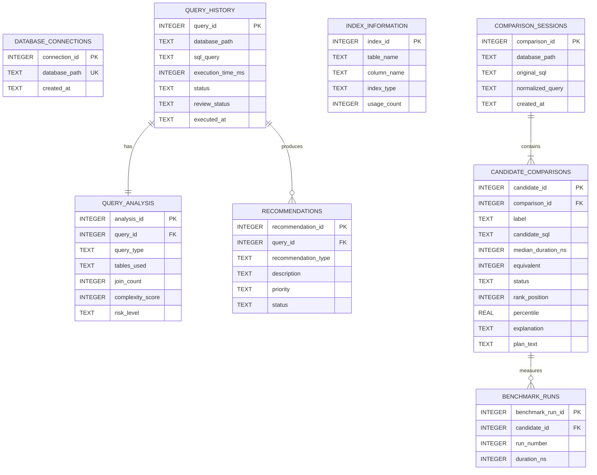

# Database ER Diagram

```mermaid
erDiagram
    DATABASE_CONNECTIONS {
        INTEGER connection_id PK
        TEXT database_path UK
        TEXT created_at
    }
    QUERY_HISTORY {
        INTEGER query_id PK
        TEXT database_path
        TEXT sql_query
        INTEGER execution_time_ms
        TEXT status
        TEXT review_status
        TEXT executed_at
    }
    QUERY_ANALYSIS {
        INTEGER analysis_id PK
        INTEGER query_id FK
        TEXT query_type
        TEXT tables_used
        INTEGER join_count
        INTEGER complexity_score
        TEXT risk_level
    }
    RECOMMENDATIONS {
        INTEGER recommendation_id PK
        INTEGER query_id FK
        TEXT recommendation_type
        TEXT description
        TEXT priority
        TEXT status
    }
    INDEX_INFORMATION {
        INTEGER index_id PK
        TEXT table_name
        TEXT column_name
        TEXT index_type
        INTEGER usage_count
    }
    COMPARISON_SESSIONS {
        INTEGER comparison_id PK
        TEXT database_path
        TEXT original_sql
        TEXT normalized_query
        TEXT created_at
    }
    CANDIDATE_COMPARISONS {
        INTEGER candidate_id PK
        INTEGER comparison_id FK
        TEXT label
        TEXT candidate_sql
        INTEGER median_duration_ns
        INTEGER equivalent
        TEXT status
        INTEGER rank_position
        REAL percentile
        TEXT explanation
        TEXT plan_text
    }
    BENCHMARK_RUNS {
        INTEGER benchmark_run_id PK
        INTEGER candidate_id FK
        INTEGER run_number
        INTEGER duration_ns
    }

    QUERY_HISTORY ||--|| QUERY_ANALYSIS : has
    QUERY_HISTORY ||--o{ RECOMMENDATIONS : produces
    COMPARISON_SESSIONS ||--|{ CANDIDATE_COMPARISONS : contains
    CANDIDATE_COMPARISONS ||--o{ BENCHMARK_RUNS : measures
```
