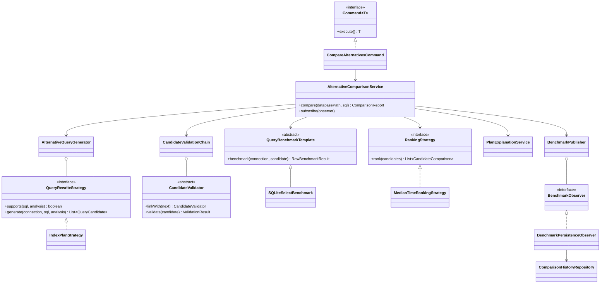

# UML Class Diagram

The editable UML class diagram is maintained in Lucidchart:

[Open the QueryLens UML Class Diagram](https://lucid.app/lucidchart/ccb6834d-bdaa-4e59-8a80-f4f87d2f175d/edit)

It documents the original design decisions: query execution, SQL analysis and plan inspection, strategy-based recommendations, observer-based persistence, repositories, and recommendation state transitions.

The alternative-comparison design is also maintained here as editable Mermaid source:

